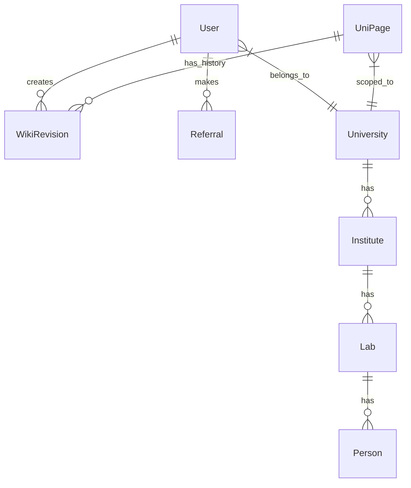

# Database & Schema

## Overview

The database is a normalized relational model designed to handle hierarchical wiki structures, user permissions, and gamification tracking. We use **Prisma** as our ORM to interact with **PostgreSQL**.

> **Note:** The `prisma/schema.prisma` file is the absolute source of truth. Refer to it for the most up-to-date field definitions.

## Core Models

### 1. Hierarchy
The wiki content is organized in a strict hierarchy:

*   **`University`**: The root container. Defined by email domains (e.g., `@tu-berlin.de`).
*   **`Institute`**: Belongs to a University (e.g., "Institute of Theoretical Physics").
*   **`Lab`**: Belongs to an Institute.
*   **`Person`**: Can belong to an Institute or a Lab.
*   **`UniPage`**: The generic content container for any of the above entities.

### 2. Users & Roles
The `User` model handles authentication and permissions.

*   `role`: Enum (`STUDENT`, `TRUSTED`, `STAFF`, `ADMIN`).
*   `universityId`: Links the user to their primary university.
*   `powerScore`: Integer tracking the user's gamification progress.
*   `isPublicProfile`: Boolean flag for privacy control.

### 3. Wiki Engine Models
These models drive the version control system.

*   **`UniPage`**: Represents the *current* state of a page. Holds the approved `content` and `slug`.
*   **`WikiRevision`**: Represents a *proposed* or *historical* change.
    *   `status`: Enum (`PENDING`, `APPROVED`, `REJECTED`, `FLAGGED`).
    *   `content`: The markdown content of this specific revision.
    *   `authorId`: User who made the change.

### 4. Gamification
*   **`Referral`**: Tracks who invited whom (`referrer` -> `referee`).
*   **`Notification`**: System alerts for users (e.g., "Your edit was approved").

## ER Diagram (Conceptual)

## Key Design Decisions

### Revisions vs. Live Content
We decouple "Live Content" (`UniPage.content`) from "Revisions" (`WikiRevision`). 
*   **Reads** are fast because we query `UniPage` directly.
*   **Writes** go to `WikiRevision` first.
*   **Approval** copies `WikiRevision.content` to `UniPage.content`.

### Search Vectors
We use PostgreSQL `tsvector` fields (e.g., `searchVector`) in models like `UniPage` and `Person` to enable performant full-text search without needing an external search engine like Elasticsearch for basic use cases.
